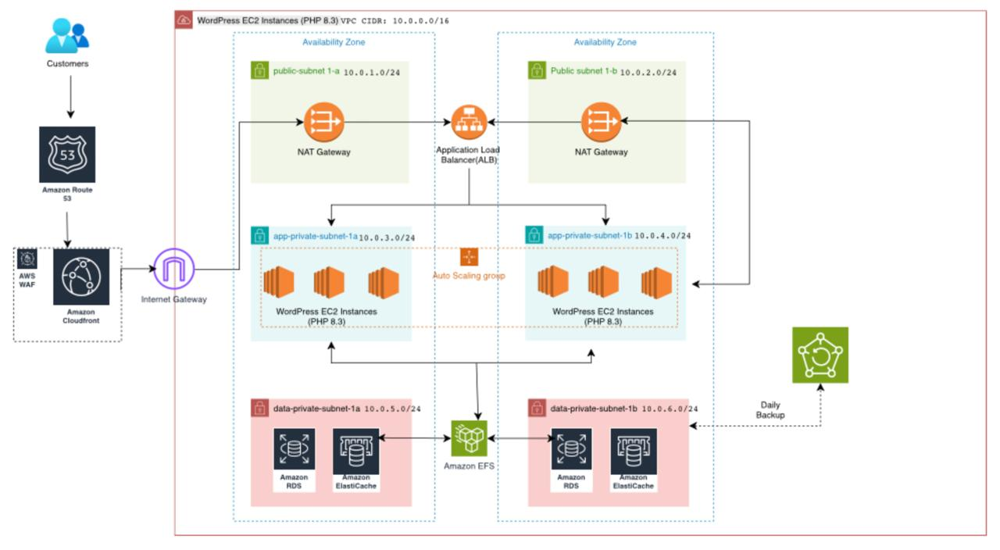
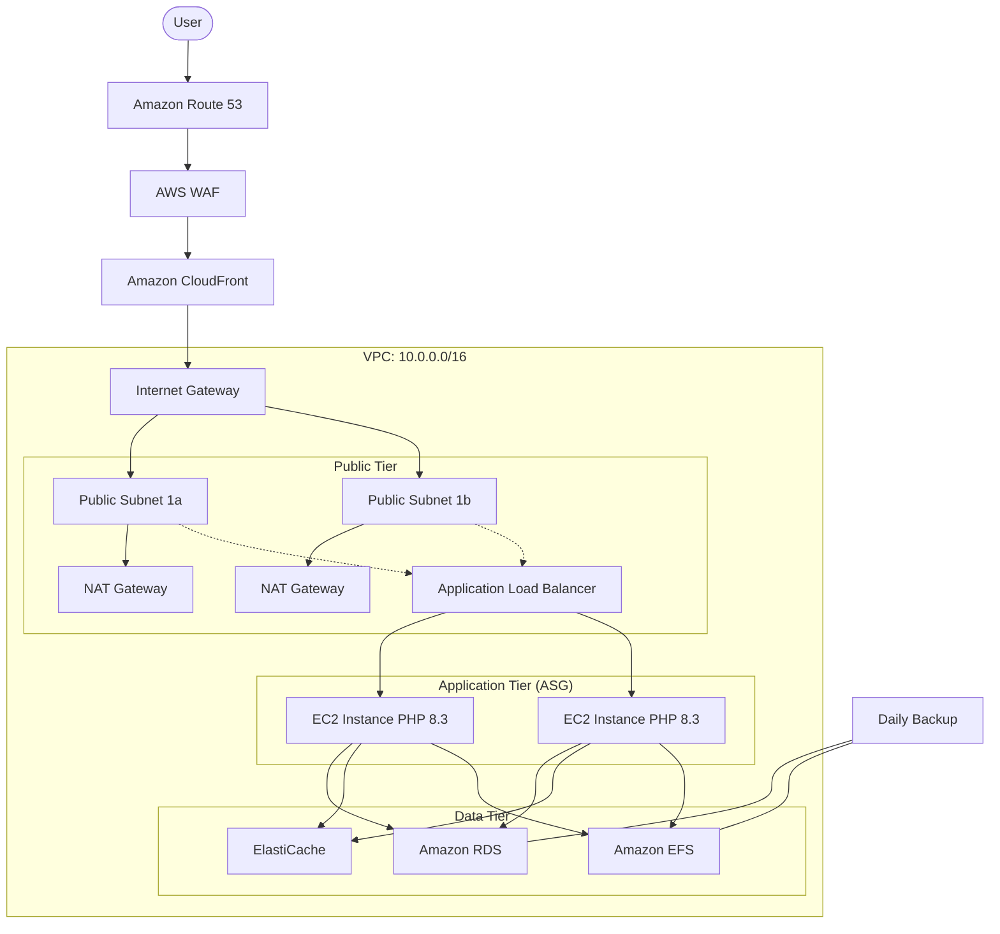

# Cloud Computing: AWS 3-Tier Architecture Project

This project showcases a highly available, scalable, and secure 3-tier web architecture on Amazon Web Services (AWS), specifically designed for a WordPress application running on PHP 8.3.

## 🏗 Architecture Overview

The architecture is deployed across two Availability Zones (AZs) within a single VPC for redundancy and fault tolerance.

### Design Screenshot

> [!NOTE]
> The original `architecture-diagram.png` is a Draw.io XML file. To see it as a rendered image on GitHub, you can export it as a PNG/JPG from [diagrams.net](https://app.diagrams.net/) and overwrite the file. In the meantime, the Mermaid diagram above provides a native visual representation.

### 🛰 Networking & Connectivity
- **VPC (10.0.0.0/16):** The base network for all resources.
- **Internet Gateway:** Connects the VPC to the public internet.
- **NAT Gateways:** Located in Public Subnets to allow resources in Private Subnets to access the internet (e.g., for updates) without being reachable from the outside.
- **Availability Zones:** Resources are split between two AZs (1a and 1b) to ensure High Availability (HA).

### 🔒 Security Layers
- **Amazon Route 53:** Scalable DNS service for domain management.
- **AWS WAF (Web Application Firewall):** Protects the application from common web exploits and bots.
- **Amazon CloudFront:** Content Delivery Network (CDN) to cache content globally and reduce latency.
- **Security Groups:** Acting as virtual firewalls for each tier (Web, App, Data).

### 💻 Application Tier (Compute)
- **Application Load Balancer (ALB):** Distributes incoming traffic across EC2 instances in different AZs.
- **Auto Scaling Group (ASG):** Automatically adjusts the number of EC2 instances based on traffic demand.
- **EC2 Instances (PHP 8.3):** WordPress application servers located in private subnets for enhanced security.
    - Subnet 1a: `10.0.3.0/24`
    - Subnet 1b: `10.0.4.0/24`

### 🗄 Storage & Database Tier
- **Amazon RDS:** Managed relational database (MySQL/Aurora) for WordPress data.
    - Subnet 1a: `10.0.5.0/24`
    - Subnet 1b: `10.0.6.0/24`
- **Amazon ElastiCache:** In-memory caching layer (Redis/Memcached) to speed up application performance.
- **Amazon EFS (Elastic File System):** Shared file storage used by all EC2 instances for WordPress media and configuration files.
- **Daily Backups:** Automated backups for persistence and disaster recovery.

## 🚀 Key Features
- **High Availability:** Fault-tolerant design across multiple AZs.
- **Scalability:** Auto-scaling ensures performance during traffic spikes.
- **Security-First:** Private subnets, WAF, and CloudFront integration.
- **Performance:** Caching via ElastiCache and CloudFront.

---
*Created as part of AWS Cloud Architecture learning.*
